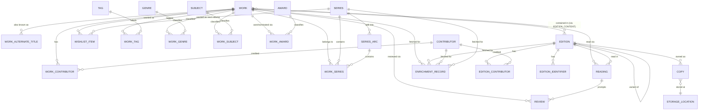
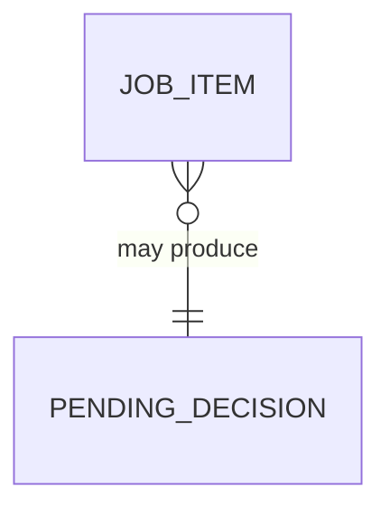

# Data model

This is a conceptual model — entities, fields, relationships, and the
reasoning behind them — not a migration file. Field types are indicative
(final types depend on the eventual storage choice, not yet decided; see
"Open questions" at the end). Read `PHILOSOPHY.md` first; this document
assumes its principles rather than re-arguing them.

## Overview

## Work

The abstract book — one row per intellectual creation, independent of
format or printing.

| Field | Notes |
|---|---|
| `id` | |
| `title` | |
| `subtitle` | optional |
| `literary_form` | `novel` / `novella` / `short_story` / `collection` / `anthology` / `nonfiction` / `essay` / `periodical` — renamed from an initial `work_type`; see note below |
| `original_publication_year` | often known even when a specific edition's date isn't |
| `original_language` | |
| `description` | synopsis/blurb, freeform |
| `notes` | private notes about the work itself, not a reading of it |
| `field_sources` | optional map, e.g. `{"description": "isfdb", "original_publication_year": "manual"}` — see `EnrichmentRecord` below and `PHILOSOPHY.md` principle 10 |

**`literary_form`, not `work_type`.** Renamed after building the
Goodreads importer surfaced a real ambiguity in the original name: is
this field structural (how the text is organized — novel vs. anthology)
or does it also cover things like biography, which is really a
subject/genre fact, not a structural one? MARC 21 answers this by
keeping the two on entirely separate fixed fields — 008/33 "Literary
form" (fiction/not fiction/essays/novels/short stories/drama/poetry/...,
a flat list with `essay` a sibling of `novel`, not nested under
nonfiction) and 008/34 "Biography" (a wholly separate field). Thema
draws the same line: biography lives in its own subject branch (`DN`
and children), not alongside its fiction-form codes. `literary_form`
matches MARC's own name for this exact field and makes the field's
scope self-documenting: extent (`novel`/`novella`/`short_story`),
compilation shape (`collection`/`anthology`), and prose form
(`essay`, with `nonfiction` as the residual "none of the fiction/essay
forms apply" bucket, mirroring MARC's own "Not fiction" value in the
same fixed field) — never a subject/genre classification like
`biography`, which belongs in `Genre`/`Tag` instead, exactly as MARC and
Thema both keep it.

**`periodical`, added during Phase 2** (`docs/INTEGRATIONS.md`) once a
real magazine issue (auto-created from the live Goodreads feed, no CSV
precedent) showed a standalone serial issue is a genuinely different
structural type — MARC/ONIX both distinguish serial/continuing resources
from monographs — not well served by defaulting to `novel` or
overloading `anthology`.

Authorship lives here via `WORK_CONTRIBUTOR` (role e.g. `author`,
`original author`, `anthology editor`) — the credit that doesn't change
printing to printing. Edition-specific credits (translator, cover artist,
narrator) live on `EDITION_CONTRIBUTOR` instead; see the note under
`Contributor` for why the split exists.

### WorkAlternateTitle

Per `PHILOSOPHY.md` principle 7 — a flat, searchable list of other titles
this work has been published under (retitled reissues, UK/US variants,
magazine serialization titles, working titles). Deliberately not a
first-class entity with its own metadata; that's the machinery ISFDB and
MARC build around this same need, and it solves a shared-multi-editor
problem this project doesn't have.

| Field | Notes |
|---|---|
| `work_id` | |
| `title` | |
| `note` | free text, e.g. `"UK title"`, `"magazine serialization (Astounding, 1954)"` |

## Edition

A specific printing/format, containing one or more works.

| Field | Notes |
|---|---|
| `id` | |
| `format` | `paperback` / `hardcover` / `ebook` / `audiobook` / `omnibus`, or **blank** — the coarse, ONIX-Codelist-150-aligned top category. Nullable, not `presence: true`: Goodreads' RSS feed (the ongoing sync, `docs/INTEGRATIONS.md` Phase 2) gives no binding/format signal at all for a newly auto-created `Edition`, and forcing a value there would fabricate data the same way an unset `publish_date` once did — left blank until real ISFDB enrichment fills it in cleanly. Originally `presence: true`, since Phase 1's CSV import always had *some* `Binding` value (even "Unknown Binding"); relaxed once Phase 2 showed that assumption doesn't hold for every import source |
| `format_detail` | optional, seeded from ONIX Codelist 175: `mass_market` (B101), `trade_us` (B102), `a_format` (B104, UK), `b_format` (B105, UK), `trade_uk` (B106), `tall_rack` (B107) — see `PHILOSOPHY.md` principle 9. Not enforced as a closed set; free text for anything the codelist doesn't cover |
| `publisher` | |
| `imprint` | e.g. Ace, DAW, Ballantine — often more meaningful than the parent publisher for vintage SF |
| `publish_date` | a plain EDTF-formatted string (`"1978"`, `"1978-06"`, or `"1978-06-15"`) — not a `date` column. Vintage paperbacks routinely only give a year, sometimes only a printing number; a `date` type can't represent "only the year is known" without fabricating a day/month, which is exactly the false precision to avoid. No separate precision column either — the string only ever contains the digits actually known, so there's nothing else to track. Originally built as a `date` column + a `publish_date_precision` enum (`day`/`month`/`year`); replaced once real ISFDB-enrichment data made the smell concrete — see `docs/INTEGRATIONS.md`'s enrichment addendum for the real numbers. |
| `printing` | e.g. "3rd printing," free text — distinct from edition_name |
| `edition_name` | e.g. "25th Anniversary Edition" |
| `variant_of_edition_id` | optional, self-referencing — per `PHILOSOPHY.md` principle 11 (Grand Comics Database's variant-issue pattern): for a later printing that's the same text but new cover art, points back to the base edition it's a cover variant of, without merging their distinct `cover_image`/cover-artist credit |
| `page_count` | |
| `duration_seconds` | audiobooks |
| `language` | |
| `cover_image` | an Active Storage attachment, not a bare URL — the image is downloaded and kept, not hotlinked. Consistent with `EnrichmentRecord`'s "keep what was fetched" ethos (principle 10): an ISFDB/OpenLibrary/Wikidata cover URL can and does go stale or disappear over time, and re-fetching later isn't guaranteed to find the same image again |
| `description` | edition-specific blurb/jacket copy, if it differs from the work's |
| `field_sources` | optional map, same pattern as `Work.field_sources` |

### EditionContent

Links `Edition` to `Work` — not a bare many-to-many, but an ordered
contents list, per `PHILOSOPHY.md` principle 3. One mechanism covers a
normal single-work edition (one row), an Ace Double (two rows), a
single-author collection or multi-author anthology (many rows), and an
omnibus (several full-novel rows) — following ISFDB's Publication-contents
model rather than treating "two novels in one book" as a special case.

| Field | Notes |
|---|---|
| `edition_id` | |
| `work_id` | |
| `display_order` | position within the edition's contents |
| `billing` | optional free text — e.g. `"front"`/`"back"` for a dos-à-dos, blank for a normal single-work edition |
| `page_start` | optional — where this content begins, when known (mainly useful for anthology contents) |

Also linked to `EDITION_IDENTIFIER` for the flexible identifier bag (see
below) and to `EDITION_CONTRIBUTOR` for printing-specific credits.

**An anthology's own `Work` row is one of its edition's contents, not
something separate from them.** An anthology (`literary_form = anthology`)
has its own `Work` row (title, description, `WORK_CONTRIBUTOR` role
`anthology editor`) — and its `Edition` links to *that* `Work` via
`EditionContent` (`billing = "whole"`, `display_order = 0`, say) in
addition to one row per constituent story-`Work`. This is what makes "I
read this whole anthology" (`Reading.work_id` = the anthology's own
`Work`) and "I read this one story from it" (`Reading.work_id` = the
story's `Work`) independently trackable, rather than the anthology's
identity being implicit in the edition alone.

### EditionIdentifier

The flexible bag replacing librarium's hardcoded `isbn_10`/`isbn_13`
columns.

| Field | Notes |
|---|---|
| `edition_id` | |
| `id_type` | `isbn13` / `isbn10` / `sbn` / `oclc` / `lccn` / `asin` / `publisher_catalog_number` / `printers_key` / `openlibrary` / `isfdb` / `goodreads` / `wikidata` / `local` |
| `value` | |
| `notes` | e.g. "price-clipped, catalog number from spine not copyright page" |

No `id_type` is unique/required across the whole table — an edition with
zero rows here (common for undated pre-ISBN paperbacks) is expected, not an
error state. Matching two editions as "the same" without a shared trusted
identifier is a manual action a person takes, never an automatic merge.

`printers_key` (per `PHILOSOPHY.md` principle 11) holds a print-run
identification code — the vintage-paperback-collecting equivalent of a
vinyl record's matrix/runout number — for when a copyright-page "1st
printing" claim is missing, ambiguous, or contradicted by a code actually
printed on the book.

## Copy

A specific physical (or, loosely, digital-license) object owned.

| Field | Notes |
|---|---|
| `id` | |
| `edition_id` | |
| `condition` | e.g. a standard grading scale (Fine/Very Good/Good/Fair/Poor) |
| `acquired_date` | |
| `acquired_source` | free text: shop name, estate sale, gift, inherited |
| `acquired_price` | |
| `inscription` | signed/inscribed notes — collector-relevant for SF paperbacks with author signings |
| `storage_location_id` | |
| `disposition` | `owned` / `sold` / `given_away` / `lost` — default `owned`; keeps sold/lost copies in history rather than deleting them |
| `notes` | |

Why a full tier and not just a count on `Edition`: it's normal to end up
owning two different printings of the same edition-as-cataloged, or an
accidental duplicate — and once a copy is signed or has a condition worth
recording, "count: 2" can't hold that. A `Copy` with no interesting fields
set behaves exactly like the simpler "count" model would have.

## StorageLocation

Deliberately lightweight — a shelf/box/room label, not a path template for
organizing files (librarium's `storage_locations` was built for that;
there's no digital-file-organization equivalent here).

| Field | Notes |
|---|---|
| `id` | |
| `name` | e.g. "Office shelf 3," "Garage box 12" |
| `parent_location_id` | optional, for box-within-room nesting |

## Contributor

A person credited on a work or edition — author, translator, illustrator,
cover artist, narrator, editor.

| Field | Notes |
|---|---|
| `id` | |
| `name` | |
| `sort_name` | e.g. "Le Guin, Ursula K." |
| `bio` | |
| `external_ids` | ISFDB/OpenLibrary author IDs etc., same flexible-bag idea as editions |
| `field_sources` | optional map, same pattern as `Work.field_sources` — see `EnrichmentRecord` |

Credited via **two** join tables rather than one, on purpose:

- `WORK_CONTRIBUTOR` (work_id, contributor_id, role, display_order,
  `credited_as`) — roles that don't vary by printing: author, original
  author.
- `EDITION_CONTRIBUTOR` (edition_id, contributor_id, role, display_order,
  `credited_as`) — roles that do: translator (differs by language edition),
  cover artist (differs by printing — this is *the* thing to get right for
  SF paperback collecting, where cover art is often the reason a specific
  printing is wanted), narrator (audiobook editions only),
  introduction/foreword author.

Librarium put all of these on the work-level `book_contributors` table
*and separately* carried a redundant `narrator`/`narrator_contributor_id`
pair of columns directly on `book_editions` — two paths to the same fact,
inconsistent with each other. Splitting cleanly by "does this vary by
edition" avoids recreating that.

`credited_as` (optional, both tables) holds the byline as actually printed,
when it differs from the contributor's canonical `name` — a pseudonym or
publisher house name. Per `PHILOSOPHY.md` principle 8, this is deliberately
lighter than ISFDB's approach of giving every pseudonym its own linked
author record: a joint pseudonym (two real people sharing one house name)
is just two contributor rows with the same role and the same `credited_as`
value, no separate pseudonym-identity graph required.

**Recommended `role` vocabulary** (not enforced — `role` stays free text,
per principle 2's spirit of not forcing structure identifiers don't need):
draw from ONIX's Contributor Role Codelist (List 17) or the MARC relator
term list rather than inventing terms ad hoc — `author`, `editor`,
`translator`, `illustrator`, `cover artist`, `introduction by`,
`afterword by`, `narrator`. Keeps personal data entry consistent without a
hard-coded enum.

## Series / SeriesArc

Carried over from librarium close to as-is.

| Field (Series) | Notes |
|---|---|
| `id` | |
| `name` | |
| `description` | |
| `status` | `ongoing` / `complete` |
| `total_count` | |
| `field_sources` | optional map, same pattern as `Work.field_sources` — see `EnrichmentRecord` |

| Field (SeriesArc) | Notes |
|---|---|
| `id` | |
| `series_id` | |
| `name` | optional named sub-arc |
| `position` | numeric, supports ordering arcs themselves |

`WorkSeries` (work_id, series_id, arc_id nullable, position numeric) links
a work into a series, optionally into one of its arcs. `position` is
numeric rather than integer so novellas/interstitial works can sit at e.g.
`2.5` without renumbering everything after them.

## Genre / Subject / Tag

Three distinct concepts, not two — added `Subject` after building the
Goodreads importer surfaced a real ambiguity between them (see below for
the reasoning, kept in full since it's the kind of thing worth not
re-deriving):

- **Genre** — a small, curated, shared vocabulary for actual fiction
  classification, at the common-usage level (SF, Fantasy, space opera,
  cyberpunk, hard SF...). Structured because it's meant to support
  filtering/browsing. Per `PHILOSOPHY.md` principle 9, seeded from
  Thema's `FL` (Science fiction) and `FM` (Fantasy) subject trees rather
  than invented from scratch, with each row optionally cross-referencing
  the corresponding BISAC code:

  | Field | Notes |
  |---|---|
  | `id` | |
  | `name` | e.g. "Science fiction: space opera" |
  | `thema_code` | optional, e.g. `FLS` |
  | `bisac_code` | optional, e.g. `FIC028090` |

  Thema seeds the starting vocabulary; it isn't a closed list — a genre
  label Thema/BISAC don't cover (e.g. "New Wave," "planetary romance") can
  still be added with both code fields left blank. Check the standard
  before inventing a new label, per principle 9, but don't block on it.
  Deliberately stays at the subgenre level, not deeper — see `Tag` below
  for why tropes/themes don't live here.
- **Subject** — a shallow, curated general-classification vocabulary,
  Dewey-flavored, covering the whole library (not just fiction):

  | Field | Notes |
  |---|---|
  | `id` | |
  | `name` | e.g. "Philosophy", "Woodworking", "Fiction" |
  | `ddc_code` | optional, top-level DDC class only (e.g. `100`), left
    blank where the real topic doesn't map cleanly onto one — never a
    deeper DDC subclass; see `db/seeds.rb` |

  Deliberately shallow by design, not by laziness: a personal library's
  real nonfiction tail is small (confirmed: ~20 real distinct topics
  across 2,306 books), and DDC's own deeper subclassing would be
  structure the data doesn't need. Real library practice backs the
  scoping decision here too — most public libraries don't apply Dewey to
  fiction at all, shelving it separately by author, because subject
  classification isn't the right tool for browsing fiction. Matched here:
  every fiction `Work` (`literary_form` other than `nonfiction`/`essay`)
  gets exactly one `Subject`, a single shared "Fiction" row — not
  classified further under `Subject`, the same way a library wouldn't
  Dewey-classify a novel beyond "this is fiction."
- **Tag** — free-form, personal, uncontrolled (`signed`, `beach-read`,
  `want-to-reread`, `duplicate-oops`). No shared vocabulary — this is
  exactly the kind of personal labeling no standard covers or should.
  Also, deliberately, where deep SF-critical tagging lives (`Big Dumb
  Object`, `First Contact`, `Posthuman`, `Political` as a *trope*, not a
  *topic* — see the distinction from `Subject` below): unlike Thema for
  Genre, there's no fetchable, coded standard for this vocabulary (the
  closest real-world analogue, the Science Fiction Encyclopedia, is a
  curated reference work, not a controlled vocabulary with stable codes),
  so treating it as free-form `Tag` is the accurate description, not a
  compromise.

**Why three, not two.** MARC 21 keeps "what a book is about" (650
Subject Added Entry — topical term) and "what kind of thing a book is"
(655 Genre/Form) on two structurally separate field families, precisely
so the same word can mean different things in each without colliding —
the Library of Congress maintains this as two separate controlled
vocabularies (LCSH for subject, LCGFT for genre/form) for exactly this
reason. The concrete case that surfaced this: "Political" as a `Genre`-
or `Tag`-level *trope* ("this SF novel has political themes") and
"Politics" as a `Subject`-level *topic* ("this nonfiction book is about
political science") are genuinely different facts, and conflating them
in one vocabulary risks a real book actually about politics getting
mistaken for political SF. `Genre` does LCGFT's job for fiction; `Subject`
does LCSH/Dewey's job for topic, deliberately not applied to fiction
beyond the single shared "Fiction" row; `Tag` absorbs both genuinely
personal labels and the deep, uncontrolled SF-critical vocabulary that
has no formal standard to seed from.

Collapsing these into fewer systems was considered and rejected each
time — they serve different jobs (fiction classification vs. general
topic vs. personal/critical labeling) and conflating them is how tag
lists end up half genre-like cruft, half personal notes, half topic
labels, useful for none of the three.

Genre labels sourced from Wikidata enrichment (its `P136` "genre" property,
pulled from Wikipedia infoboxes) won't reliably match Thema's controlled
codes one-to-one — expect loose/manual matching at ingestion time, falling
back to an uncoded `Genre` row (blank `thema_code`/`bisac_code`) rather
than forcing a bad match. Not a schema problem, just a real ingestion-time
fact worth expecting rather than being surprised by.

## Award / WorkAward

Awards (Hugo, Nebula, Locus, ...) attach to the `Work`, not a specific
printing — matching Wikidata's own model (`P166` award received / `P1411`
nominated for, both on the book-work item, `P585` qualifying the year).
Found missing during a review of `~/projects/obsidian-wikidata-lookup`
(the Obsidian plugin already fetching this from Wikidata for scifipraxis
reviews) and `~/projects/scifipraxis`'s `wikidata_panel.html`, which
already renders award badges and includes them in the site's JSON-LD — a
real, currently-displayed feature this data model had no representation
for at all until now.

| Field (Award) | Notes |
|---|---|
| `id` | |
| `name` | e.g. "Hugo Award for Best Novel" — Wikidata typically models each award+category combination as its own item, so the label is taken as-is rather than split into separate name/category fields |
| `wikidata_id` | optional cross-reference; Wikidata is the de facto shared vocabulary for awards the same way Thema is for genre, so seed/match against it per `PHILOSOPHY.md` principle 9 rather than inventing free-text award names that drift (`"Hugo"` vs `"The Hugo Award"` vs ...) |

| Field (WorkAward) | Notes |
|---|---|
| `work_id` | |
| `award_id` | |
| `year` | |
| `status` | `won` / `nominated` — matches exactly what the existing plugin already distinguishes (`awards_won` / `awards_nominated`), no finer-grained shortlist/longlist status invented beyond what the real source data provides |

Plural by nature (a work can win or be nominated for several awards, across
several years for a series) — no `field_sources`/`EnrichmentRecord`
provenance machinery needed here, same reasoning as `EditionIdentifier`.

Wikidata's `P840` "narrative location" (e.g. "Mars," "generation ship")
is fetched by the existing plugin as `settings` but isn't rendered
anywhere in the live site — dead data in production today. Not modeled
here either: if it's ever wanted, plain `Tag` already covers it, and
building a dedicated controlled vocabulary for fictional settings for a
field that isn't even currently displayed would be solving a problem that
doesn't exist yet.

## Reading

The append-only log — the core fix over librarium's mutable status field.
One row per read-through, forever.

| Field | Notes |
|---|---|
| `id` | |
| `work_id` | |
| `edition_id` | which printing/format was actually read — may differ from any owned `Copy` (e.g. read a library ebook of a paperback you own) |
| `copy_id` | optional — set when the specific physical copy read is known/relevant |
| `status` | `reading` / `completed` / `dnf` / `paused` |
| `date_started` | |
| `date_finished` | null while in progress or if `dnf` |
| `dnf_reason` | free text, only relevant when `status = dnf` |
| `rating` | 0–5, half-star increments — this reading's rating, independent of any other reading of the same work. Same scale as `Review.rating` (see below), confirmed against scifipraxis's live production scale (`page.stars`, schema.org `bestRating: 5`) rather than invented — no conversion needed if a reading becomes a published review |
| `private_notes` | reading-in-progress notes; not published anywhere |
| `source` | `owned_copy` / `library` / `borrowed` / `other` — access channel only. Format (print/ebook/audiobook) is never repeated here; it's already `Reading.edition_id → Edition.format`, so "a library ebook of a paperback you own" is `source=library` + an ebook `edition_id`, not a conflict between two format-flavored enum values |

"Have I read this work" and "how many times" are queries over this table
(`COUNT(*) WHERE work_id = ? AND status = 'completed'`), never stored
fields — so there's nothing to keep in sync and nothing that can silently
go stale the way `reread_count` could.

## Review

A published, curated review — distinct from a `Reading`'s private notes,
per `PHILOSOPHY.md` principle 5.

| Field | Notes |
|---|---|
| `id` | |
| `work_id` | |
| `reading_id` | optional — the reading that prompted it, when there's a clear one-to-one link |
| `text` | |
| `rating` | 0–5, half-star increments (matches scifipraxis's live `page.stars`/schema.org scale exactly) — the *published* rating, which may still deliberately differ in value from the linked reading's private rating even though the scale is the same |
| `status` | `draft` / `published` |
| `published_at` | |
| `channels` | flexible field (JSON-like), not yet a normalized table — see `PHILOSOPHY.md` principle 5 for why this is intentionally deferred |

Expected shape of `channels` for now, informally: a list of
`{channel, url, posted_at}` — enough to link out to the Instagram post,
Goodreads review, and website post without committing to per-channel
columns before real cross-posting patterns are known.

## WishlistItem

Deliberately self-contained, not a reference — confirmed by stress-testing
against a future feature (browsing a metadata provider and adding a
result to the wishlist, not just Goodreads' `wishlist` shelf). Considered
and rejected: creating a real `Work`/`Edition` at wishlist time with
"not owned" derived from the absence of a `Copy` — elegant-looking, but
inconsistent with the Goodreads-wishlist rule already settled (see
`docs/INTEGRATIONS.md`), and it commits to a specific edition before one
is actually owned (you might wishlist a listing for one printing and
later acquire a different one entirely). Also considered: referencing a
cached `EnrichmentRecord` — doesn't fit `EnrichmentRecord`'s design, which
is always attached to an already-catalogued entity, not something that
doesn't exist as a `Work` yet; and a browse-time cache can go stale over
the months a wishlist item might sit unfulfilled anyway. `external_ids`
already covers what that option was reaching for, without either problem.

| Field | Notes |
|---|---|
| `id` | |
| `title` | |
| `author_name` | free text — the wanted book may not exist as a `Work` row yet |
| `cover_url` | bare URL string, not an Active Storage attachment — proportionate to how speculative a wishlist entry is; downloading/storing an image is deferred until the book is actually acquired and gets a real `Edition.cover_image` |
| `work_id` | optional, once matched to a real `Work` |
| `series_id` | optional — restored from librarium's own `wishlist_items.series_id`, dropped in the initial port without a reason. Lets "next volume I need in this series" be tracked even before the specific book is known as a `Work` — a common completionist habit for numbered SF lines |
| `priority` | |
| `notes` | |
| `external_ids` | same flexible-bag pattern — a matched OpenLibrary/ISFDB/Goodreads id, used to drive a *fresh* enrichment fetch when the item is fulfilled, not a pointer to a stale cached one |

Fulfillment (however the item arrived — Goodreads shelf sync or a future
provider-browse feature): fetch fresh via `external_ids`, create the real
`Work`/`Edition`/`Copy`/`EnrichmentRecord` through the normal enrichment
path, then delete the `WishlistItem` outright. No merge, no conversion.

## EnrichmentRecord

The raw snapshot behind a metadata-provider fetch (ISFDB, OpenLibrary,
Wikidata, ...) — per `PHILOSOPHY.md` principle 10. Kept in full, not
reduced to an Open-Library-style bare identifier, since a personal
collection's scale can afford it: this is what lets a source be re-diffed
later or fields re-derived without re-fetching if mapping logic improves.

| Field | Notes |
|---|---|
| `id` | |
| `entity_type` | `work` / `edition` / `contributor` / `series` |
| `entity_id` | |
| `provider` | `isfdb` / `openlibrary` / `wikidata` / ... |
| `external_id` | the provider's own identifier for this record |
| `fetched_at` | |
| `raw_payload` | the fetched record, verbatim (JSON) |

`entity_type`/`entity_id` (rather than separate nullable `work_id`/
`edition_id`/... columns) matches librarium's own `cover_images` table
(`entity_type`, `entity_id`), which already generalizes across books,
contributors, and series for the same "attach this to any of several
entity kinds" reason. `Contributor` (bio, birth/death dates — `isfdb-
adapter`'s `/authors/{id}` returns exactly these) and `Series`
(description, total_count — `/series/search` returns these too) are just
as enrichable as `Work`/`Edition` and carry their own `field_sources` map
for the same reason.

Applying a fetched value to a real field is a distinct, deliberate step
from fetching it — never automatic for a field that already has a value.
Filling a genuinely empty field can happen without a prompt; overwriting a
non-empty one always surfaces a confirm/diff step, regardless of how many
providers agree. When applied, the target field's `field_sources` entry is
set to that provider's name; a manual edit afterward resets it to
`"manual"` so a later enrichment run knows not to silently clobber a
deliberate correction.

This mechanism only applies to single-valued fields. `EditionIdentifier`,
`WorkAlternateTitle`, and `Contributor.external_ids` need none of it —
they're one-to-many already, so ISFDB's and OpenLibrary's values for the
same fact simply coexist as separate rows/entries.

## GoodreadsSyncState

New in Phase 2 (`docs/INTEGRATIONS.md`) — not present when this document
was first written. Tracks the last-synced state of one `(goodreads_book_id,
shelf)` pair, so the ongoing RSS sync can detect a genuine change on the
next poll rather than re-processing every item every run.

| Field | Notes |
|---|---|
| `id` | |
| `goodreads_book_id` | Goodreads' own id — stable, always present in the feed |
| `shelf` | which shelf this state applies to (`wishlist`/`to-read`/`currently-reading`/`read`/`did-not-finish`) |
| `last_synced_payload` | JSONB — shape depends on shelf (e.g. `{user_rating, user_read_at, user_review}` for `read`; `{user_date_added}` for `currently-reading`; `{}` for `wishlist`/`to-read`, which have nothing dynamic to track once cataloged), same flexible-payload pattern as `EnrichmentRecord`/`PendingDecision` rather than a fixed column set |
| `created_at` / `updated_at` | |

Unique on `(goodreads_book_id, shelf)`. Comparison is always against
**this latest snapshot**, never a permanent "have we ever seen this
combination" set — a reverted value (an edited review reverted, a reread
landing back on a previously-seen rating) must re-trigger a sync, not
look already-handled. See `docs/INTEGRATIONS.md` for the full reasoning
and the existing-pipeline precedent this replaces.

## Operational entities

Cross-cutting concerns, not domain/bibliographic ones — but real enough to
belong here rather than being left to "figure out later." Per
`PHILOSOPHY.md` principles 13–16: scheduling/execution and audit/
versioning are bought from a maintained library, not modeled as opsimath's
own tables — only the genuinely domain-specific pieces below are.

(No `Job`/`JobEvent` entities — that bookkeeping lives in Solid Queue's own
tables, per principle 13. No `FreeTextHistory`/`deleted_at` either —
that's PaperTrail, per principle 15, applied to `Work`, `Edition`, `Copy`,
`Contributor`, `Series`, `Review.text`, and `Reading.private_notes`.
Neither is a schema opsimath defines itself.)

### JobItem

The one piece no library can know: within a single scheduled/queued run,
which of the (say) 200 books succeeded or failed, and why. Deliberately
not wrapped in a bespoke `Job` envelope table — `run_id` just correlates
back to Solid Queue's own identifier for that execution, rather than
opsimath re-tracking status/timing the library already tracks.

| Field | Notes |
|---|---|
| `id` | |
| `run_id` | opaque — Solid Queue's own identifier for this run |
| `entity_type` / `entity_id` | same polymorphic pattern as `EnrichmentRecord` — one shape covers an import row and an enrichment target alike |
| `status` | `success` / `failed` / `skipped` |
| `message` | free text |

### PendingDecision

The queue a run writes to when it hits something needing a human call
instead of blocking — per principle 14. Resolves the tension between
principle 10 ("always confirm a non-empty-field overwrite") and a batch
run that can't pop two hundred synchronous dialogs. Kept custom
deliberately — checked against Airflow/Prefect/Temporal and found all
three the wrong shape (DAG orchestration engines, not a review queue) for
what this actually needs, per principle 16.

| Field | Notes |
|---|---|
| `id` | |
| `kind` | Real, shipped kinds as of Phase 2: `enrichment_field_conflict` / `enrichment_edition_mismatch` (ISFDB enrichment — see `docs/INTEGRATIONS.md`'s enrichment addendum), `possible_duplicate_work` (Goodreads sync — `Matcher` found more than one ambiguous title+author match), `reread_conflict` (Goodreads sync — a `currently-reading` event fires while a `Reading` for that work is already open). `unmatched_shelf_entry` is designed for but not currently triggered by any code path — the confirmed auto-create policy (`docs/INTEGRATIONS.md`) handles the plain "no match" case directly instead of routing it here. Extends to further kinds (e.g. `series_match_candidate`) the same way, without a new mechanism |
| `run_id` | optional — set when produced by a batch run, null for a one-off interactive lookup |
| `payload` | JSON — shape depends on `kind`. `enrichment_field_conflict`: entity/field, current value, proposed value(s) with their source(s) — one genuinely isolated field dispute. `enrichment_edition_mismatch`: entity plus an array of the several fields disagreeing at once — see `docs/INTEGRATIONS.md`'s enrichment addendum for why this is a different question ("does this ISBN match the right printing at all") from a single-field dispute, not just several of those bundled for convenience |
| `status` | `pending` / `accepted` / `rejected` |
| `created_at` / `resolved_at` | |

### User / Session / ApiToken (authentication only)

Per `PHILOSOPHY.md` principle 19 — Rails 8's built-in
`bin/rails generate authentication` scaffold, generated as-is rather than
designed here: a `User` (`has_secure_password`) and a `Session` (token,
IP, user agent). This exists purely to gate access to the app behind a
login; it carries **no** relationship to any other entity in this
document — no ownership, no roles, no per-library membership. Exactly one
`User` row is expected to ever exist. This is not a reversal of "single-
owner, no multi-tenancy" (`PHILOSOPHY.md` Non-goals) — that principle is
about not building sharing/RBAC/multiple libraries, which this doesn't
touch; it's a login gate, not a multi-user system.

`ApiToken` — confirmed needed (per `docs/INTEGRATIONS.md`) for automation/
integration access separate from the human login, matching librarium's
own PAT pattern (`internal/api/middleware/auth.go`). Not required by the
Goodreads sync itself (principle 20's self-contained job calls Ruby code
directly, no HTTP round-trip to authenticate), but a real near-term need
for other external access.

| Field | Notes |
|---|---|
| `id` | |
| `user_id` | belongs to the one `User` |
| `name` | free text label, e.g. "aswarm" or a future mobile client |
| `token_digest` | hashed, never the raw token, after issuance |
| `last_used_at` | |
| `created_at` | |

No scopes/permissions system — single-user, single-purpose tokens are
enough for now; add scoping later only if a real need for it shows up.

## Open questions (intentionally not decided here)

- ~~**Storage engine.**~~ **Resolved: Postgres.** Confirmed alongside
  Ruby on Rails/ActiveRecord (`PHILOSOPHY.md` principle 17) — which also
  happens to settle principle 13's Solid Queue coupling favorably, since
  Solid Queue's `FOR UPDATE SKIP LOCKED` locking wants Postgres/MySQL to
  perform well under concurrent workers (not that a single-user app's
  actual concurrency needs would have forced the issue on their own).
- ~~**Goodreads integration shape.**~~ **Resolved: see `docs/INTEGRATIONS.md`.**
  Bulk CSV import (one-time) plus an ongoing self-contained Solid Queue
  sync (shelf RSS polling, diffed against `GoodreadsSyncState`, above) —
  built, deployed to production, and running on an hourly recurring
  schedule, ahead of any UI, per `PHILOSOPHY.md` principle 20. Confirms
  `Review.channels`' first real shape (`channel: goodreads`, from `My
  Review`). ISFDB enrichment specifically already has a running answer,
  not just a future one: `~/projects/isfdb-adapter`'s JSON API
  (`/isbn/{isbn}`, `/search`, `/series/*`, `/authors/*`) is deployed and
  reusable as-is; the integration work is a client, not a new service.
- ~~**Full-text search.**~~ **Resolved: Postgres native** (`tsvector`/
  `tsquery` + GIN indexes on `Work.title`/`description`, matching exactly
  what librarium's own schema already did with `idx_books_fulltext`). Its
  blocking condition ("once a storage engine is chosen") is now met;
  adopting Postgres's own full-text search rather than a separate search
  service (Elasticsearch/Meilisearch) is the same principle-16 test as
  everything else — a dedicated search engine solves a scale problem this
  collection doesn't have.
- **Cover-image search** (reverse image lookup — find a book by matching
  its cover photo) — kept as its own genuinely open want, separated out
  from full-text search rather than bundled with it. Real future feature,
  not scope creep, but no design work done on it yet; revisit once the
  core app exists and `Edition.cover_image` (now an Active Storage
  attachment, see above) has real images to search against.
- **Formalizing `Review.channels`** — revisit after real usage, per
  principle 5.
- ~~**Title filing/sort order.**~~ **Resolved: a Postgres function**,
  ported from librarium's own `sort_title()` (strips leading articles —
  "the," "a," non-English equivalents — per MARC filing rules) and
  `natural_sort_key()` (so "Bleach #19" sorts after "Bleach #1," not
  before, as a plain string comparison would) rather than a stored
  column — computed at query time, same approach librarium already
  proved out, now that Postgres is confirmed as the engine that function
  needs to live in.
- **Offline-capable multi-device sync** — not being built now (per
  `PHILOSOPHY.md` principle 15), but a real possible future, not
  foreclosed. If it ever becomes real, librarium's `000018`–`000021`
  migrations (per-field last-write-wins timestamps, tombstones,
  append-only conflict history, a `sync_clients` device-cursor table) are
  the concrete reference design to adapt, not something to redesign from
  first principles.

See `PHILOSOPHY.md`'s "Considered and explicitly not adopted" for two
things that came up in research and were deliberately left out (a
Calibre-style generic custom-columns mechanism; Z39.50/SRU as a metadata
source) — not open, decided against, but worth knowing were considered.
